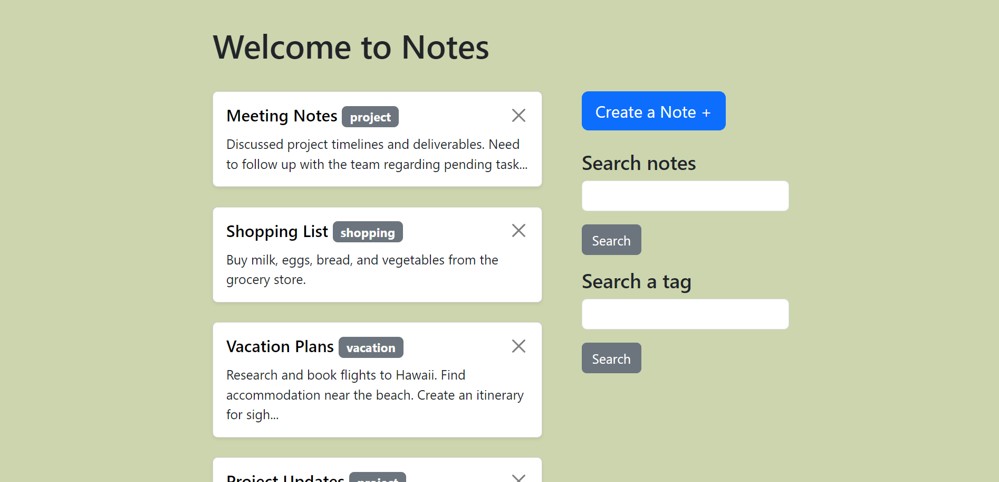
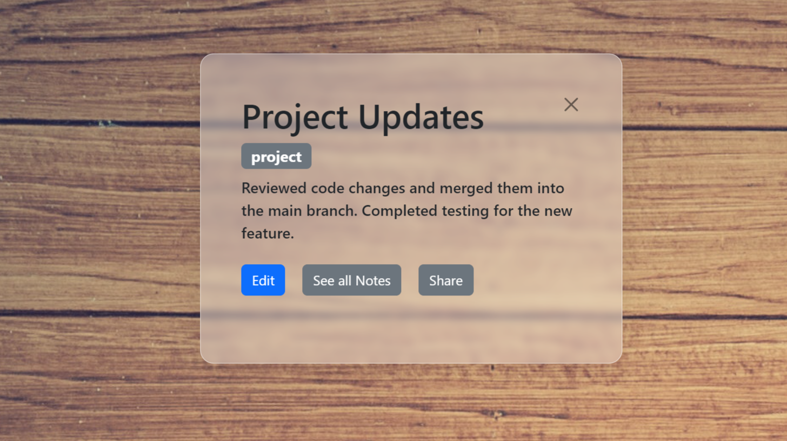
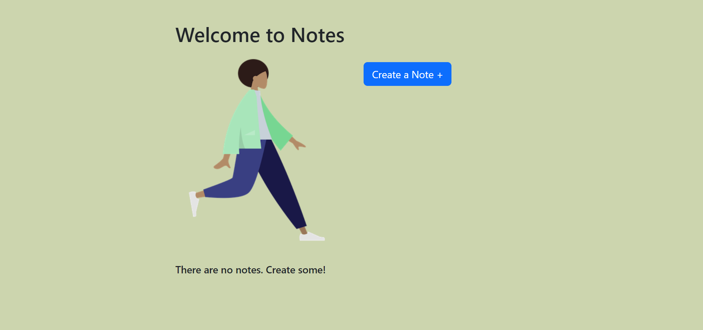

# Notes App

A minimal PHP app for storing, editing, deleting, and searching notes.

## Features

- Create new notes with a title, note body, and note tag.
- Edit existing notes to update their content.
- Delete notes that are no longer needed.
- Search notes by tags or keywords to find specific information quickly.

## Images

